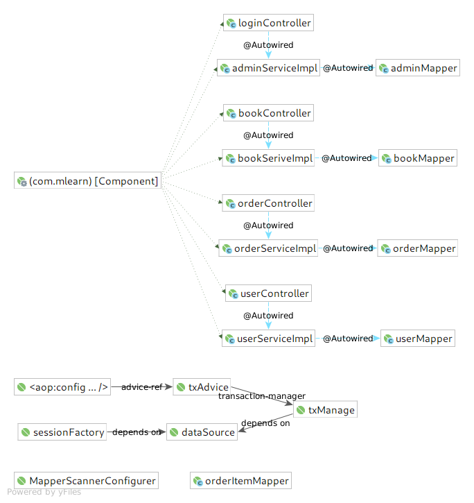
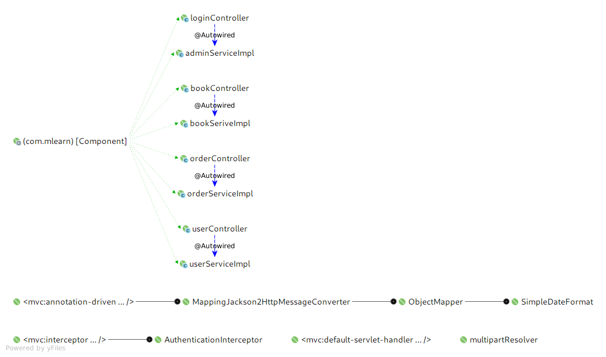

# mlearn
Admin template.

0. Config : 

 - ApplicationContext

    

 - Spring mvc
    
    
    
1. class define

 - Package Name: Args[class]

 - Vo: ResultUtil
 
 - Config: AuthenticationInterceptor
 
 - Controller: AdminController, BookController, UserController, LoginController
 
 - Service(Implement): AdminService, BookService, OrderService, UserService
 
 - Entity: Admin, Book, Order, OrderItem, User
 
 - Mapper: AdminMapper, BookMapper, OrderItemMapper, OrderMapper, UserMapper
 
 - Util: CacheUtil, EncryptUtil, FileUtil, HexUtil, JsonUtil, QiNiuUtil
 
2. Detail design

 - login:
    
    No encryption frontend, Ajax send username & password directly.

    Backstage: Sha256(salt + password_from_front).equals(exist_password) -> update salt and password

 - BookCSM & UserCSM & OrderCSM

    - FontEnd send request using RESTFul API like this:

        - GET: localhost/user check all users
        
        - POST: localhost/user add user

        - PUT: localhost/user/1 update user whose id equals 1

        - DELETE: localhost/user/1 delete user whose id equals 1

        - And so on.

    But one thing need to care: I do not use **token** to do the **Authentication** , and simplify the process with session instead.

    - BackEnd 

        - Controller will receive the form data and inject them to the entity located in the controller method.

        - Service will handle the whole transactions of this project. And it will entrust mapper to deal with the database

        - Mapper will handle the reciprocal process between the database and programmar.

    - Summary (Process)

        - So the abvoe is the whole process. Almost all of them like:
        `page[ajax:request]->Controller[function:args]->Service[function:args]->(Entity : ResultSet)Mapper[xml or annotation:Sql]->(Entity, Exception)Service->(Response)Controller->page[js:dom rendering]

3. Qiniuyun image storage

    - Upload function is implemented by qiniuyun sdk. You could get more infos from [here](https://developer.qiniu.com/kodo/sdk/1239/java).

4. TODO:

    - Token realized OR

    - Redis realize the session function

        - redis save user like this:  `userID : jsessionid` , then get cookie jsessionid from client and compare to get the user.

    
    

